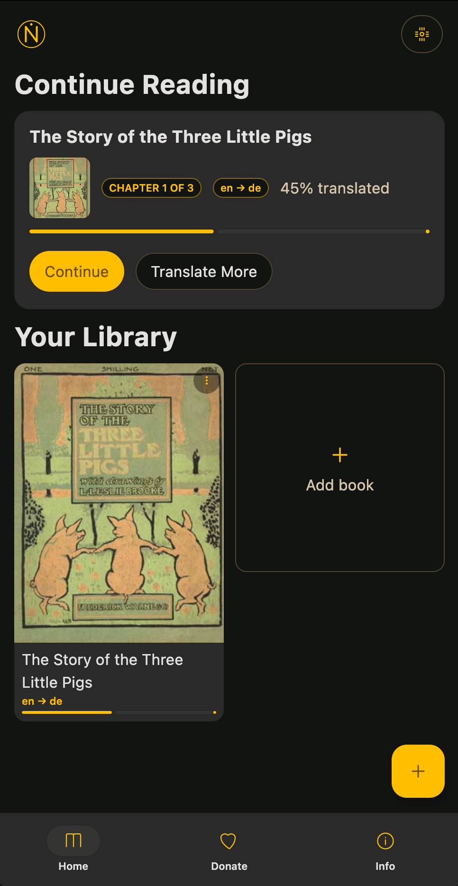
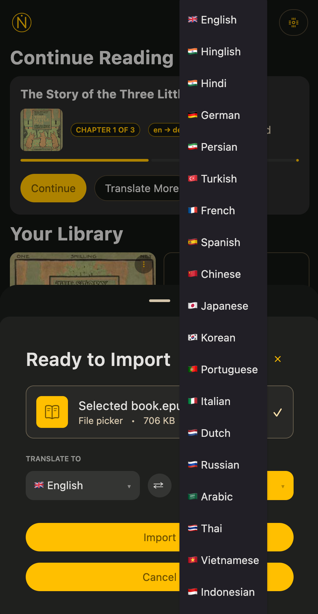
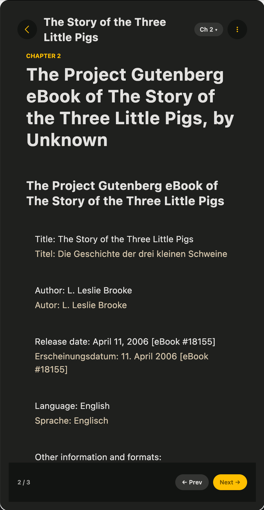
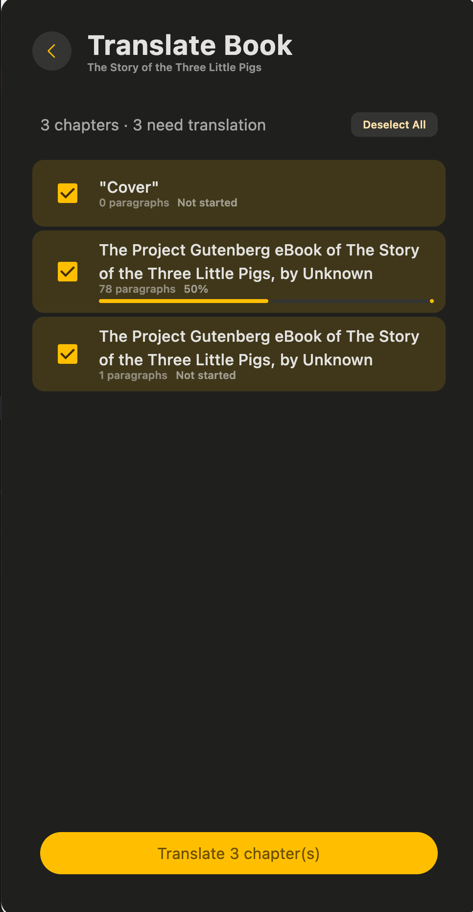
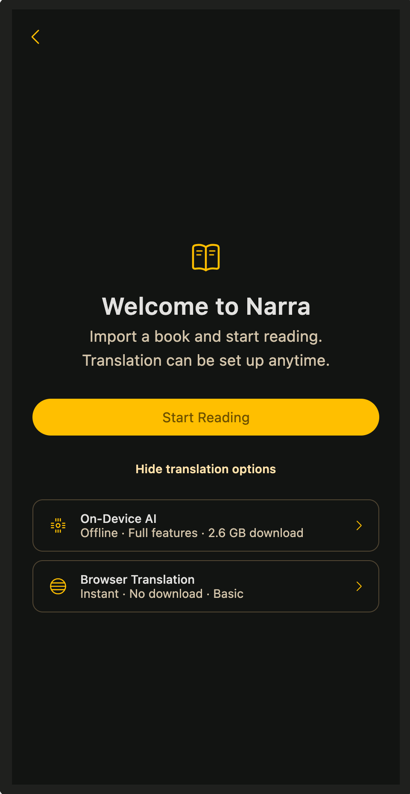
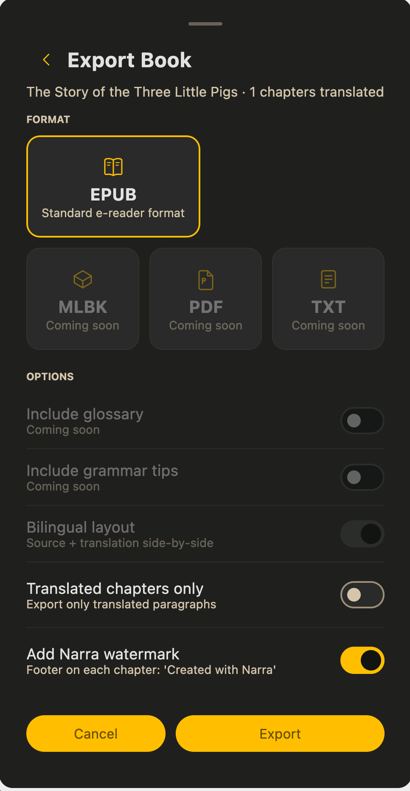
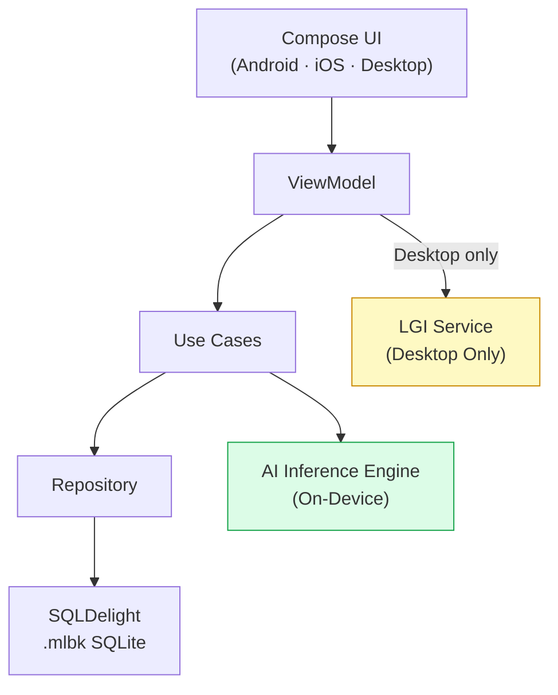

# 📖 Narra

> **An offline-first, AI-powered multilingual e-reader** — translate any book into a bilingual reading experience, tap any word for instant glossary and grammar tips, entirely on your device with zero cloud and zero data transfer.

  

---

## 🎬 Demo

https://github.com/dhirajhimani/Narra-Public/raw/master/assets/demo_v1.0.0.mp4

---

## 📸 Screenshots

  
  
  

  
  
  

---

## ✨ What Is Narra?

Narra takes any standard text and rebuilds it in real-time as an interactive, bilingual learning experience — **entirely on your device**, with no cloud, no subscription, and no data leaving your hands.

The problem it solves is simple: reading in a foreign language is exhausting. Every unknown word forces you to break flow, open a dictionary, lose context, and slowly lose the will to continue. Narra eliminates that friction.

---

## 🏗 The Four Pillars

### 1. 🔤 Intelligent Bilingual Layout
Every original paragraph is immediately followed by its translation in your target language. No tab-switching. No lookups. Two languages side by side on the same page.

### 2. 🧠 Local AI Brain — 100% On-Device
All translation tasks run on your phone's own hardware using on-device AI models — small, fast, and private.

- Works on a plane, in a tunnel, anywhere — **zero internet required**
- No API keys, no monthly cost, no rate limits
- Your books and reading habits **never touch a server**

### 3. 🎬 Visual Chapter Recaps *(planned)*
At the end of each chapter, the AI will analyze the chapter's emotional arc, key events, and character states, then drive a real-time GPU-accelerated animation recap. A cinematic summary that cements what you just read as a visual memory.

> 🚧 Chapter recaps are currently disabled while we iterate on the animation engine.

### 4. 📦 Dual Export System

| Format | Container | Use Case |
|---|---|---|
| `.mlbk` | SQLite database | Full native experience — animations, interactive glossary, grammar tips |
| `.epub` | ZIP / XHTML | Portable bilingual read on Kindle, Kobo, or any e-ink device |

---

## 📱 Platform Support

| Feature | Android | iOS | Desktop (JVM) |
|---|---|---|---|
| Bilingual reading | ✅ | ✅ | ✅ |
| On-device AI translation | ✅ | ✅ | ✅ |
| Glossary + Grammar tips | ✅ | ✅ | ✅ |
| `.mlbk` + `.epub` export | ✅ | ✅ | ✅ |
| Chapter visual recaps | 🚧 | 🚧 | 🚧 |

---

## 🔒 Privacy First

Narra is **100% offline-first**. No cloud AI API calls. No telemetry. No user data leaves the device. Full compliance with Apple Guideline 5.1.2(i).

Language models (~30 MB per language) download on demand and run entirely locally after that.

---

## 🛠 Tech Stack

| Layer | Technology |
|---|---|
| Language | Kotlin (Multiplatform) |
| UI | Compose Multiplatform |
| AI Translation | On-device ML Kit (~30 MB per language) |
| Database | SQLDelight (SQLite) |
| Navigation | Voyager |
| DI | Koin |
| Server (dev) | Ktor (Netty) |

---

## 🎯 Who Is This For?

**Primary:** A motivated language learner who already reads books and wants to use that habit as the vehicle for acquisition. Frustrated by the constant interruption of dictionary lookups — wants a tool that keeps them *in the story* while still teaching the language.

**Secondary:** Educators building bilingual curricula, and travellers who need offline reading in a foreign language.

---

## 💡 The Value Proposition

| Old Way | Narra Way |
|---|---|
| Read → hit unknown word → open dictionary → lose context | Read with the translation already there — never lose the thread |
| Cloud AI translation → pay monthly → trust them with your data | Everything runs locally — one-time app, permanent capability |
| EPUB is either original or translated — never both | EPUB exports are bilingual by default |

---

## 📥 Downloads

### Android

Or grab the APK directly: [Narra-release.apk](https://github.com/dhirajhimani/Narra-Public/releases)

### macOS

[Narra.dmg](https://github.com/dhirajhimani/Narra-Public/releases)

All releases: [GitHub Releases](https://github.com/dhirajhimani/Narra-Public/releases)

### Distribution

| Platform | Channel | Status |
|---|---|---|
| Android | [Google Play Store](https://play.google.com/store/apps/details?id=com.forthepeoples.narra) + GitHub Releases (APK) | ✅ Live |
| iOS | Apple App Store + TestFlight | 🔜 Coming soon |
| macOS | GitHub Releases (DMG) | ✅ Live |
| Windows | GitHub Releases (MSI) | 🔜 Coming soon |
| Linux | GitHub Releases (DEB) | 🔜 Coming soon |

---

## 🏗 Architecture

**Layer rule:** `presentation → domain → data → native AI interop`. Never skip or reverse.

---

## 🚀 Getting Started

1. **Install** — Download Narra from [Google Play](https://play.google.com/store/apps/details?id=com.forthepeoples.narra) or grab the [macOS DMG](https://github.com/dhirajhimani/Narra-Public/releases)
2. **Download a language model** — On first launch, Narra guides you through a quick one-time download (~30 MB per language pair, Wi-Fi recommended)
3. **Import a book** — Tap the `+` button and import any EPUB file from your device
4. **Start reading** — Open the book and the bilingual reader is ready. Tap any word for an instant glossary entry.

That's it. No account, no sign-in, no subscription.

---

## ❓ FAQ

**Which languages are supported?**  
100+ languages via on-device AI models. You select your native language and the language you want to learn at import time.

**How much storage does it need?**  
The app itself is lightweight. Each language model is ~30 MB and downloaded on demand — you only download the language pairs you need.

**Does it work without internet?**  
Yes, completely. After the initial model download, Narra works 100% offline — on a plane, underground, anywhere.

**Can I use my own EPUB books?**  
Yes. Narra imports standard EPUB files. You bring your own books — we don't sell or host content.

**Is there a size limit on books?**  
No hard limit. Very large books may take longer to translate — Narra translates on-demand as you read, so you can start instantly without waiting for the whole book.

**Why does it need a model download?**  
Translation runs entirely on your device — no cloud, no API. The small language model is what makes that possible. It downloads once and is reused for every book in that language pair.

**Is my reading data private?**  
Completely. Narra has no analytics, no telemetry, and no server. Your books, reading progress, and vocabulary data never leave your device.

---

## 🤝 Contributing

Narra is developed in a private monorepo. This public repo serves as:
- 📦 **Release distribution** — download builds here
- 📋 **Issue tracker** — report bugs and request features
- 📖 **Documentation** — learn about the project

If you're interested in contributing, please [open an issue](https://github.com/dhirajhimani/Narra-Public/issues) to discuss.

---

## 📄 License

Narra is dual-licensed:

- **App & Shared Code:** [Apache License 2.0](LICENSE-APACHE.md)
- **Native AI Bindings:** [Business Source License 1.1](LICENSE-BSL.md) (converts to Apache 2.0 on 2029-05-22)

---

## 📝 Writing

- **[What if your AI app didn't need the internet?](https://dev.to/dhiraj_himani_36f2516907e/what-if-your-ai-app-didnt-need-the-internet-755)** — The story behind building Narra: on-device AI, thermal management, and why offline-first is a feature not a constraint.

---

## 📬 Contact

- **Issues:** [GitHub Issues](https://github.com/dhirajhimani/Narra-Public/issues)
- **Discussions:** [GitHub Discussions](https://github.com/dhirajhimani/Narra-Public/discussions)

---

  <em>Built with ❤️ using Kotlin Multiplatform — runs entirely on your device.</em>

