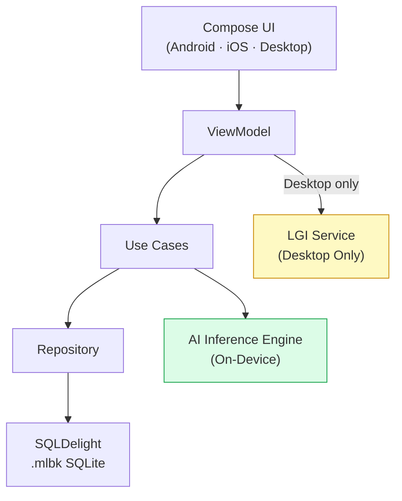

# 📖 Narra

> **An offline-first, AI-powered multilingual e-reader** — translate any book into a bilingual reading experience, generate vocabulary glossaries and grammar tips, and close each chapter with a GPU-accelerated visual recap, entirely on your device with zero cloud and zero data transfer.

---

## ✨ What Is Narra?

Narra takes any standard text and rebuilds it in real-time as an interactive, bilingual learning experience — **entirely on your device**, with no cloud, no subscription, and no data leaving your hands.

The problem it solves is simple: reading in a foreign language is exhausting. Every unknown word forces you to break flow, open a dictionary, lose context, and slowly lose the will to continue. Narra eliminates that friction.

---

## 🏗 The Four Pillars

### 1. 🔤 Intelligent Bilingual Layout
Every original paragraph is immediately followed by its translation in your target language. No tab-switching. No lookups. Two languages side by side on the same page.

### 2. 🧠 Local AI Brain — 100% On-Device
All generative tasks — translation, glossary extraction, grammar-tip generation, and animation scripts — run on your phone's own hardware using a quantized Small Language Model.

- Works on a plane, in a tunnel, anywhere — **zero internet required**
- No API keys, no monthly cost, no rate limits
- Your books and reading habits **never touch a server**

### 3. 🎬 Visual Chapter Recaps *(planned)*
At the end of each chapter, the AI will analyze the chapter's emotional arc, key events, and character states, then drive a real-time GPU-accelerated animation recap. A cinematic summary that cements what you just read as a visual memory.

> 🚧 Chapter recaps are currently disabled while we iterate on the animation engine.

### 4. 📦 Dual Export System

| Format | Container | Use Case |
|---|---|---|
| `.mlbk` | SQLite database | Full native experience — animations, interactive glossary, grammar tips |
| `.epub` | ZIP / XHTML | Portable bilingual read on Kindle, Kobo, or any e-ink device |

---

## 📱 Platform Support

| Feature | Android | iOS | Desktop (JVM) | Web |
|---|---|---|---|---|
| Bilingual reading | ✅ | ✅ | ✅ | ✅ (pre-translated only) |
| On-device AI translation | ✅ | ✅ | ✅ | ❌ |
| Glossary + Grammar tips | ✅ ¹ | ✅ ¹ | ✅ ¹ | ✅ (from `.mlbk`) |
| `.mlbk` + `.epub` export | ✅ | ✅ | ✅ | ❌ |
| Chapter visual recaps | 🚧 | 🚧 | 🚧 | 🚧 |
| LGI image/video generation | ❌ | ❌ | ✅ | ❌ |

> ¹ Glossary and grammar tips require the on-device AI model to be downloaded.

---

## 🔒 Privacy First

Narra is **100% offline-first**. No cloud AI API calls. No telemetry. No user data leaves the device. Full compliance with Apple Guideline 5.1.2(i).

The AI model (~2.5 GB) downloads once post-install, then everything runs locally forever.

---

## 🛠 Tech Stack

| Layer | Technology |
|---|---|
| Language | Kotlin (Multiplatform) |
| UI | Compose Multiplatform |
| AI Inference | llama.cpp (via Llamatik wrapper) |
| SLM | Qwen 3.5 4B — GGUF Q4_K_M |
| Database | SQLDelight (SQLite) |
| Navigation | Voyager |
| DI | Koin |
| Server (dev) | Ktor (Netty) |

---

## 🎯 Who Is This For?

**Primary:** A motivated language learner who already reads books and wants to use that habit as the vehicle for acquisition. Frustrated by the constant interruption of dictionary lookups — wants a tool that keeps them *in the story* while still teaching the language.

**Secondary:** Educators building bilingual curricula, and travellers who need offline reading in a foreign language.

---

## 💡 The Value Proposition

| Old Way | Narra Way |
|---|---|
| Read → hit unknown word → open dictionary → lose context | Read with the translation already there — never lose the thread |
| Finish a chapter → vague memory | Finish a chapter → watch a visual recap that locks it in |
| Cloud AI translation → pay monthly → trust them with your data | Everything runs locally — one-time app, permanent capability |
| EPUB is either original or translated — never both | EPUB exports are bilingual by default |

---

## 📥 Downloads

> 🚧 **Coming Soon** — Narra is currently in active development.

Release artifacts (APK, DMG, etc.) will be published as [GitHub Releases](https://github.com/dhirajhimani/Narra-Public/releases) on this repo.

### Planned Distribution

| Platform | Channel |
|---|---|
| Android | Google Play Store + GitHub Releases (APK) |
| iOS | Apple App Store + TestFlight |
| macOS | GitHub Releases (DMG) |
| Windows | GitHub Releases (MSI) |
| Linux | GitHub Releases (DEB) |

---

## 🏗 Architecture

**Layer rule:** `presentation → domain → data → native AI interop`. Never skip or reverse.

---

## 🤝 Contributing

Narra is developed in a private monorepo. This public repo serves as:
- 📦 **Release distribution** — download builds here
- 📋 **Issue tracker** — report bugs and request features
- 📖 **Documentation** — learn about the project

If you're interested in contributing, please [open an issue](https://github.com/dhirajhimani/Narra-Public/issues) to discuss.

---

## 📄 License

Narra is dual-licensed:

- **App & Shared Code:** [Apache License 2.0](LICENSE-APACHE.md)
- **Native AI Bindings:** [Business Source License 1.1](LICENSE-BSL.md) (converts to Apache 2.0 on 2029-05-22)

---

## 📬 Contact

- **Issues:** [GitHub Issues](https://github.com/dhirajhimani/Narra-Public/issues)
- **Discussions:** [GitHub Discussions](https://github.com/dhirajhimani/Narra-Public/discussions)

---

  <em>Built with ❤️ using Kotlin Multiplatform — runs entirely on your device.</em>

